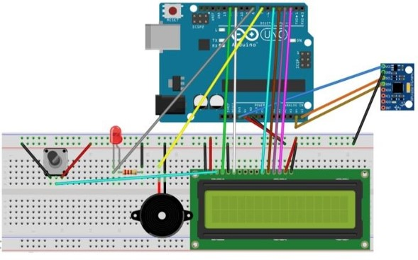

# Arduino Earthquake Detector

## Overview
This project is an Arduino-based earthquake detector that utilizes an MPU6050 sensor, an LED, a buzzer, and an LCD display. The device monitors seismic activity through gyroscope data and alerts users by triggering an LED and buzzer if the values exceed a predefined threshold.

## Components Used
- Arduino UNO
- MPU6050 Sensor (Gyroscope and Accelerometer)
- LED
- Buzzer
- 16x2 LCD Display
- Breadboard and Jumper Wires
- Soldering Iron (for permanent connections)
- Resistors and Other Basic Electronics Components

## Circuit Diagram
Refer to the  for wiring instructions. The diagram is essential for setting up the connections between the Arduino, MPU6050, LED, buzzer, and LCD display.

## Software Requirements
- [Arduino IDE](https://www.arduino.cc/en/software) (for uploading code to the Arduino UNO)
- Libraries:
  - `MPU6050.h`
  - `Wire.h`
  - `LiquidCrystal.h`

## Setup Instructions
1. **Wiring:**
   - Connect the MPU6050 sensor to the Arduino using the I2C pins (SDA, SCL).
   - Connect the LED and buzzer to the designated digital pins.
   - Attach the LCD display to the appropriate pins on the Arduino.
   - Use the breadboard to organize and connect all components.

2. **Software:**
   - Install the necessary libraries (`MPU6050.h`, `Wire.h`, `LiquidCrystal.h`) in your Arduino IDE.
   - Upload the `Earthquake_detector.ino` sketch to the Arduino UNO.
   - Adjust the LCD contrast using the code provided if you do not have a potentiometer.

## Operation
- Once powered, the device initializes the MPU6050 sensor and displays the project name on the LCD.
- The MPU6050 continuously monitors gyroscope data.
- If the rotational values on any axis exceed the threshold (425 or -425), the LED and buzzer are activated to indicate potential seismic activity.
- The gyroscope readings can be monitored via the Serial Monitor in the Arduino IDE.

## Applications
This project demonstrates a basic earthquake detection system, but the MPU6050 sensor can be used in various other applications, such as drones, balancing robots, and more.

## Contributions
Feel free to fork this repository and contribute to improving the project!

## Contact
For any inquiries or suggestions, feel free to contact me through [LinkedIn](https://www.linkedin.com/in/arnav-latiyan-696615297/).

